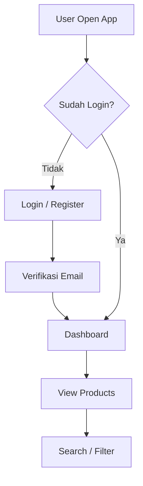

# 🚀 Toko Koreku App


---

## 📖 About The Project

**Toko Koreku** adalah aplikasi mobile berbasis Flutter yang dikembangkan sebagai bagian dari tugas mata kuliah. Aplikasi ini berfokus pada sistem autentikasi pengguna dan manajemen data produk dengan integrasi backend API dan Firebase Authentication.

Aplikasi ini mengimplementasikan konsep **Clean Architecture** untuk menjaga struktur kode tetap scalable, modular, dan mudah dikembangkan.

---

## 🧠 Key Concepts

* Clean Architecture (Separation of Concern)
* State Management menggunakan Provider
* REST API Integration dengan Dio
* Firebase Authentication (Email & Google Sign-In)
* Secure Token Storage

---

## 🛠️ Tech Stack

### Frontend

* Flutter
* Provider (State Management)
* Dio (HTTP Client)

### Backend

* Golang (REST API)
* MySQL (Database)

### Services

* Firebase Authentication
* Flutter Secure Storage

---

## ✨ Features

### 🔐 Authentication

* Login dengan Email & Password
* Register akun baru
* Verifikasi Email
* Google Sign-In
* Secure Token Handling

### 🛍️ Product Dashboard

* Menampilkan daftar produk
* Search produk
* Filter kategori
* Responsive UI

### 🎨 UI Components

* Custom Button
* Custom Text Field
* Loading Overlay
* Google Sign-In Button
* Reusable Widgets

---

## 🏗️ Project Structure

```bash
lib/
├── core/
│   ├── constants/     # API config, warna, string
│   ├── theme/         # Tema aplikasi
│   ├── services/      # Dio client, secure storage
│   └── routes/        # Routing aplikasi
│
├── features/
│   ├── auth/          # Login, register, verifikasi
│   └── dashboard/     # Produk & tampilan utama
│
├── shared/
│   └── widgets/       # Komponen reusable UI
│
├── firebase_options.dart
└── main.dart
```

---

## 🔄 Application Flow



---

## ⚙️ Installation & Setup

### 1. Clone Repository

```bash
git clone https://github.com/username/toko_koreku.git
cd toko_koreku
```

### 2. Install Dependencies

```bash
flutter pub get
```

### 3. Firebase Setup

```bash
flutterfire configure
```

Pastikan file `firebase_options.dart` sudah tersedia.

---

### 4. Run Backend (Golang)

```bash
go run main.go
```

---

### 5. Run App

```bash
flutter run
```

---

## 📼 Link Youtube

| https://youtu.be/iXzIQ79rH_8?si=w0gVoczFFyfa5ZAb |
| ------------------------------------------------ |

---

## 🔐 Security Notes

* Password di-handle menggunakan Firebase Authentication
* Token disimpan menggunakan Secure Storage
* API communication menggunakan HTTPS (disarankan)

---

## 👨‍💻 Author

* **Rian Maulana**
* NIM: 1123150061

---

## 📌 Notes

Project ini dibuat untuk keperluan akademik dan pembelajaran.
Masih terbuka untuk pengembangan lebih lanjut.